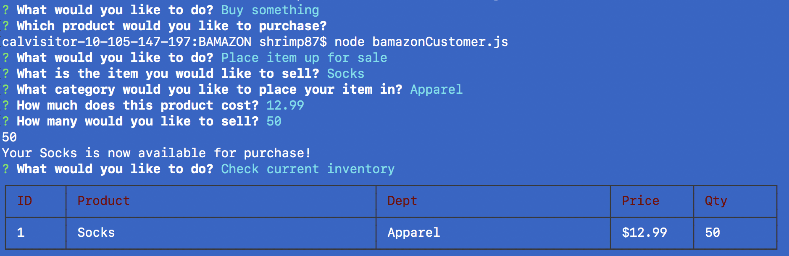
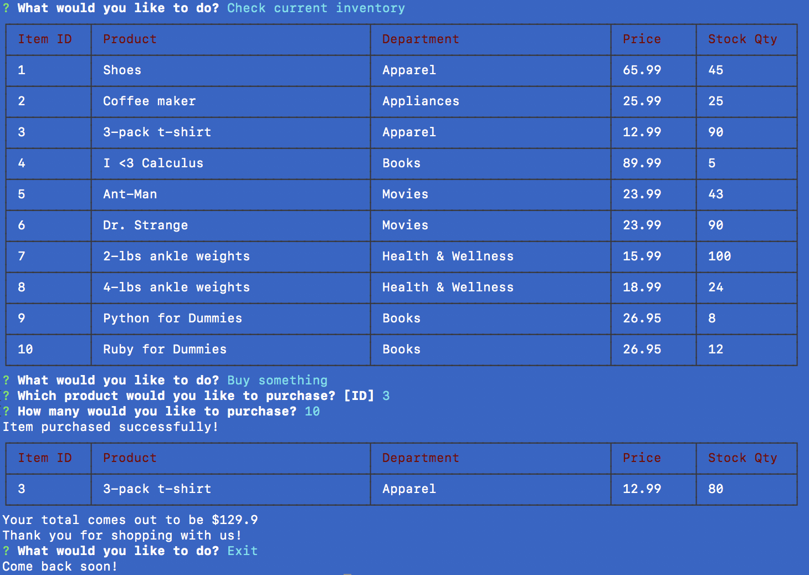

# BAMAZON
Using MySQL to create/maintain a digital inventory and using node.js to make purchases/sales via user input.

Currently working:

Post an item for sale
Exit the app
Check inventory
Purchase from existing inventory

Here we're able to see that the app allows us to place an item into the database and put it up for sale.

This image shows us that we can check on the current inventory, purchase an item that exists within the inventory, and updates the quantity of the selected item.
